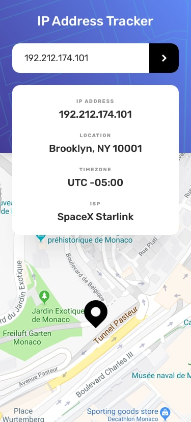

# Frontend Mentor - IP address tracker solution

This is a solution to the [IP address tracker challenge on Frontend Mentor](https://www.frontendmentor.io/challenges/ip-address-tracker-I8-0yYAH0). Frontend Mentor challenges help you improve your coding skills by building realistic projects. 

## Table of contents

- [Overview](#overview)
  - [The challenge](#the-challenge)
  - [Screenshot](#screenshot)
  - [Links](#links)
- [My process](#my-process)
  - [Built with](#built-with)
  - [What I learned](#what-i-learned)
  - [Useful resources](#useful-resources)
- [Author](#author)


## Overview

### The challenge

Users should be able to:

- View the optimal layout for each page depending on their device's screen size
- See hover states for all interactive elements on the page
- See their own IP address on the map on the initial page load
- Search for any IP addresses or domains and see the key information and location

### Screenshot



### Links

- Solution URL: [Github](https://github.com/allfigueiredodev/ip-adress-tracker.git)
- Live Site URL: [Github Pages](https://allfigueiredodev.github.io/ip-adress-tracker/)

## My process

### Built with

- HTML5
- CSS
- Flexbox
- SASS
- Mobile-first workflow
- Leaflet
- Ipify API

### What I learned

I keep using SASS preprocessor in my apprenticeship and ended up learning a trick to make the border smaller than the container, as shown in the design provided. 

```css
  & + .data-wrapper:before {
            content: "";
            height: 90%;
            width: 1px;
            position: absolute;
            left: -2rem;
            top: 5%;
            background-color: $dark-gray;
          }
```

First time using leafleJS, the documentation helped me to set up everything very quick.

```html
    <link
      rel="stylesheet"
      href="https://unpkg.com/leaflet@1.9.2/dist/leaflet.css"
      integrity="sha256-sA+zWATbFveLLNqWO2gtiw3HL/lh1giY/Inf1BJ0z14="
      crossorigin=""
    />
    <script
      src="https://unpkg.com/leaflet@1.9.2/dist/leaflet.js"
      integrity="sha256-o9N1jGDZrf5tS+Ft4gbIK7mYMipq9lqpVJ91xHSyKhg="
      crossorigin=""
    ></script>
```

A little tip here, if you don't set the values of the iconAnchor Icon option to half of the iconSize width and height respectively, the marker will be way off the real location as you zoom in and out on the map.   

```js
let myIcon = L.icon({
  iconUrl: "./images/icon-location.svg",
  iconSize: [50, 60], 
  iconAnchor: [25, 30], 
});
```

### Useful resources

- [LeafletJS](https://leafletjs.com/) - An open-source JavaScript library for mobile-friendly interactive maps.
- [Ipify](https://geo.ipify.org/) - IP Geolocation API allows you to locate and identify website visitors by IP address. IP location helps prevent fraud, customize web experiences, and maintain regulatory compliance.

## Author

- Github - [Allesson Figueiredo](https://github.com/allfigueiredodev)
- Frontend Mentor - [@allfigueiredodev](https://www.frontendmentor.io/profile/allfigueiredodev)
